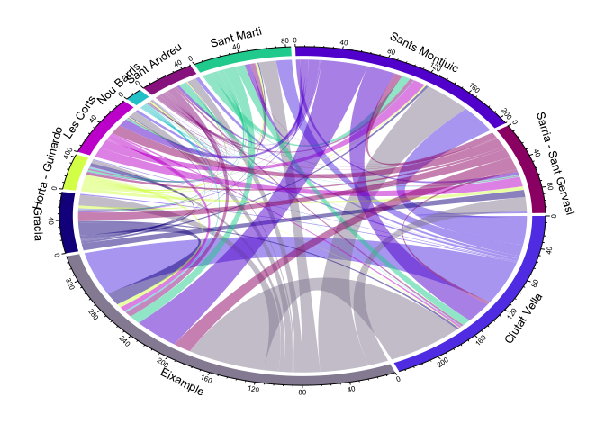

# Chord diagram

This script generates a Chord diagram, i.e., a diagram that shows relationship among a group of items (or migration data).

In this specific example we imagine to have a dataframe containing data about some transictions among Barcelona districts.


#### The dataset is stored in a csv file ("chord_data.csv") and has the following format:

```
##           from               to      value
## 1 Ciutat Vella         Eixample 57.0625000
## 2 Ciutat Vella           Gracia  1.5208333
## 3 Ciutat Vella Horta - Guinardo  0.9791667
## 4 Ciutat Vella        Les Corts  3.0833333
## 5 Ciutat Vella       Nou Barris  0.4166667
## 6 Ciutat Vella      Sant Andreu  3.5625000
```

#### Function to generate the diagram

```r
  createChordDiagram <- function (inputFile, outputFilePlot){ #, outputFileData

    library(circlize)
    library(plyr)
    set.seed(999)

    migration_file <- inputFile
    migration <- read.csv(migration_file, sep = ',', header = TRUE)

    head(migration)

    g = chordDiagram(migration)
    print(g)

    pdf(outputFilePlot) # save in pdf

    g = chordDiagram(migration)
    print(g)

    circos.clear()
    dev.off()
}
```


#### Create diagram and save it in the chord_plot.pdf file


```r
createChordDiagram(inputFile = 'chord_data.csv', outputFilePlot = 'chord_plot.pdf')
```



